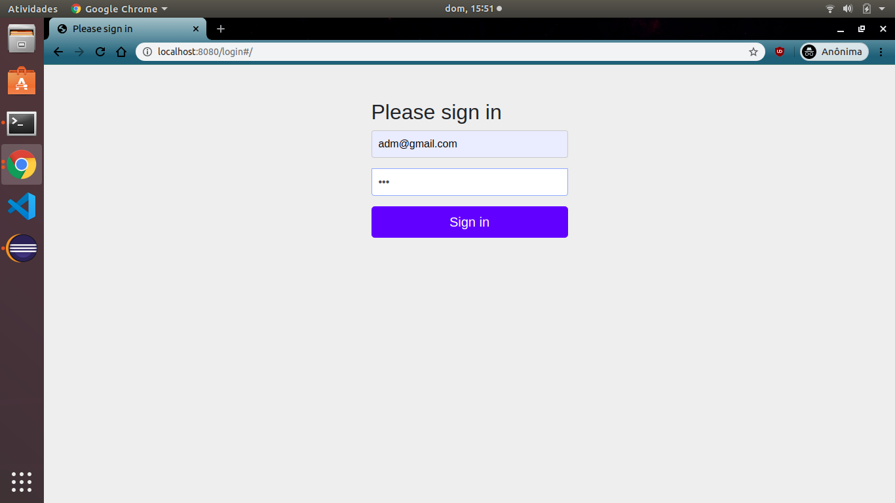
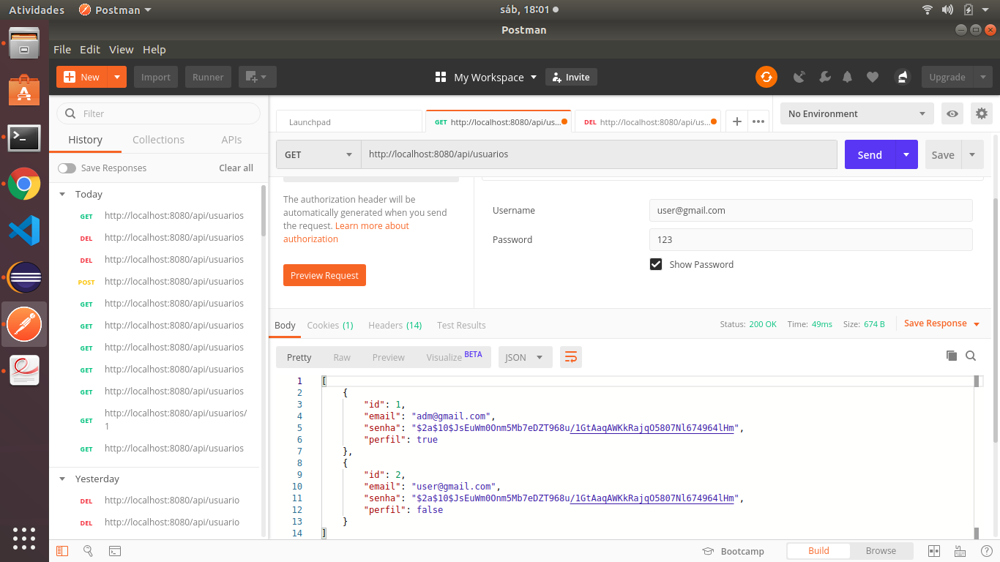

# Api Rest User Control

Api feita para o teste de desenvolvimento JAVA.
Esta api foi feita utilizando um ambiente onde o sistema operacional é o Ubuntu 18.04.3 e a IDE utilizada foi o Eclipse, openjdk 1.8 e Maeven 3.6.

## Rodando a aplicação.

1 - Clone este repositório com o comando:
        
        https://github.com/lorryaze/apir-rest.git

2  - Caso você seja um usuário linux para executar a aplicação execute os comandos:

    $ cd apir-rest
    
    $ cd apirest
    
    $ ./mvnw spring-boot:run

Caso não seja faça o download do eclipse ou alguma IDE de sua preferência e clique em RUN.

3 - A aplicação está rodando na porta 8080 então basta abrir o navegado de sua preferência e digitar:

    localhost:8080/swagger-ui.html#/

Para realizar a proteção da api foi utilizado o Spring boot Security.
Quando você executar o passo 3 um formulário de login será exibido as
credenciais são login: adm@gmail.com, e senha: 123

As requisições da api também foram testadas no postman, caso queira testa-lás abra o postman coloque as mesmas credenciais acima ou caso queira logar com rule de USER digite as credenciais login user@gmail.com e senha: 123

O deploy da aplicação foi feito no Heroku para caso não queira rodar a aplicação localmente basta acessa:
        
https://apirest-usuarios.herokuapp.com/swagger-ui.html

As credenciais de login são: adm@gmail.com, e senha: 123.
